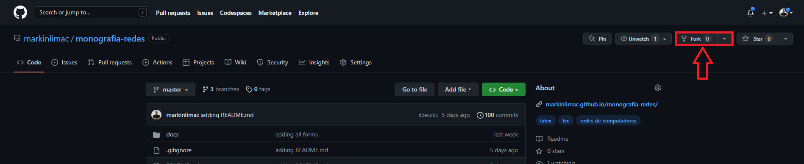
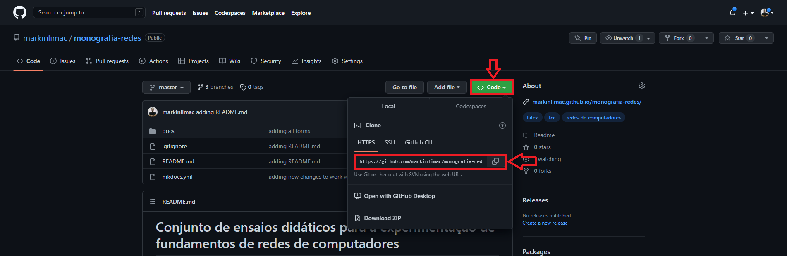

# Conjunto de ensaios didáticos para a experimentação de fundamentos de redes de computadores

No mundo atual, o uso das redes de computadores se tornou algo imprescindível no sentido de obter e compartilhar informações. Compreende-se que redes de computadores são um conjunto de computadores autônomos interconectados, de modo que os computadores possam funcionar tanto em conjunto quanto independentes uns dos outros. No contexto de engenharia de software, as redes de computadores passam a ter um papel fundamental no desenvolvimento e provimento de novas aplicações. Portanto, é essencial que alunos que cursam bacharelado em Engenharia de Software obtenham conhecimento para operação básica e resolução de problemas relacionados às camadas de rede. Porém, um dos grandes problemas enfrentados hoje no ensino de rede de computadores é a pouca disponibilidade de equipamentos adequados para a utilização de ferramentas e o conteúdo teórico massivo que é lecionado enquanto o discente participa apenas como ouvinte. Desse modo, o presente trabalho propõe a implementação de um conjunto de experimentos práticos para exercitar a operação básica de uma rede de computadores utilizando os sistemas operacionais Linux e FreeBSD, demonstrando a viabilidade da aprendizagem prática no ensino de redes de computadores.

Este trabalho foi desenvolvido durante o Trabalho de Conclusão de Curso 2 pelo aluno Marco Antônio de Lima Costa como requisito para graduação em Engenharia de Software pela Universidade de Brasília. A aplicação pode ser acessada em: https://markinlimac.github.io/monografia-redes/.

## Estrutura do Repositório
### Docs
Pasta que contém os arquivos de código da documentação.

* Debian: Pasta que contém os arquivos de código da documentação referentes ao Debian.
* Files: Pasta que contém arquivos importantes para a aplicação.
* Freebsd: Pasta que contém os arquivos de código da documentação referentes ao FreeBSD.
* Img: Pasta que contém arquivos de imagem usadas na aplicação.
* index.md: Arquivo de código da documentação referente a página inicial da aplicação.
* main.js: Arquivo de código javascript que contém algumas funções comumente utilizadas na aplicação. Pode ser importante para criação de novas funcionalidades.
* style.css: Arquivo de estilização css que contém alguns estilos comumente utilizados na aplicação. Pode ser importante para criação de novas funcionalidades.

### .gitignore
Arquivo de configuração do Git que permite especificar quais arquivos e pastas não devem ser rastreados pelo Git e não devem ser incluídos em commits.

### README.md
Arquivo frequentemente utilizado como uma documentação inicial de um projeto ou repositório em plataformas de hospedagem de código, como o GitHub (Este arquivo).

### mkdcos.yml
Arquivo de configuração utilizado pelo MkDocs, que permite criar documentação em formato Markdown para projetos.

## Dependências
* [Python](https://www.python.org/)
* [MkDocs](https://www.mkdocs.org/): Gerador de sites estáticos voltado para documentação (técnica) de projetos.
* [mkdocs-markdownextradata-plugin](https://github.com/rosscdh/mkdocs-markdownextradata-plugin): Um plug-in MkDocs que permite criar variáveis extras no mkdocs.yml para serem usadas nos arquivos markdown.
* [Material for MkDocs](https://squidfunk.github.io/mkdocs-material/): Tema para MkDocs.

## Como Implementar no seu repositório
1. Faça um fork deste repositório  
<p align="center">
  
</p>
Após fazer o fork você terá uma cópia do projeto em um repositório próprio, onde é possível fazer todas as alterações que quiser na branch master.

2. Crie um clone local do seu fork
<p align="center">
  
</p>
Após copiar a URL de clone do repositório, deve-se criar um clone no computador usando o comando do Git. Para isso abra o Git Bash e cole o endereço, como o exemplo a seguir:

```bash
$ git clone <endereço do repositorio>
```
Feito isso você terá em sua máquina o código do presente repositório.

3. Instale as dependências:
```bash
$ pip install mkdocs
$ pip install mkdocs-markdownextradata-plugin
$ pip install mkdocs-material
``` 
    
4. Abra o projeto no editor de texto de sua preferência.

5. Configure o arquivo [mkdocs.yml](mkdocs.yml):
    * site_name: Define o nome do site.
    * repo_name: Define o nome do repositório.
    * repo_url: Define a url do repositório.
    * extra>teacher>email: Variável criada com o plugin "mkdocs-markdownextradata-plugin" para armazenar email que recebera os formulários de *Questões para Estudo* preenchidos.
    * nav: Serve para criar novas páginas e definir a navegação delas no site.

6. Configure os arquivos *markdown* que farão parte da página web. O presente repositório possui um [template](template.md) dos arquivos que ja estão implementados, para facilitar a adição de novos conteúdos.

7. Para executar o projeto localmente:
```bash
$ mkdocs serve
```

8. Após todos os testes basta fazer o commit das alterações, enviar para o repositório remoto (git push). E para publicar a página no github pages basta executar o comando:
``` bash
$ mkdocs gh-deploy
``` 
Ao fazer isso, o próprio MkDocs criará uma branch chamada gh-pages com o conteúdo da página estática e servirá sua aplicação usando o github.io. A url para acessar a sua página será exibida na saída do comando.

### Observação
Para adicionar perguntas na seção *Questões para Estudo*, basta adicionar o seguinte trecho de código, alterando o id da textarea, dentro da tag form:
```html
    <p class="question">Texto da questão</p>
    <div>
        <textarea rows="4" id="0"></textarea>
    </div>
```
## Licença
Este projeto é licenciado sob a licença MIT - consulte o arquivo [LICENSE.md](LICENSE.md) para mais detalhes.

## Contato
[Marco Antônio de Lima Costa](https://github.com/markinlimac)  
Email: markinlimac@gmail.com  
Telefone: (61) 98287-5322  
Linkedin: https://www.linkedin.com/in/marcolimac/
