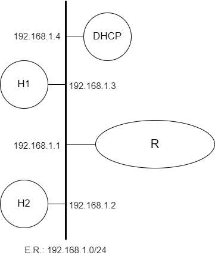

# Camada de Aplicação (DHCP)

[Baixar como PDF](files/debian/Pratica_de_Laboratorio_05.pdf)


<p align="center" style="font-family:Trebuchet MS;">Prática de Laboratório 05</p>
<p align="center"><b>Camada de Aplicação (DHCP)</b></p>

## *Introdução*
Para o correto funcionamento de redes, alguns serviços de nível de aplicação complementam as funções básicas de rede, oferecendo funcionalidades que facilitam a administração da rede. Um dos mais úteis serviços de rede em uso nas redes TCP/IP hoje, é implementado pelo protocolo DHCP (*Dynamic Host Configuration Protocol*).

## *Objetivos*
1. Visualizar a importância dos serviços de atribuição dinâmica de configurações.
2. Entender como funciona a implementação do DHCP no Linux, e configurá-la.

## *Teoria abordada no experimento*
Objetivo e funcionamento do protocolo DHCP.

## *Material Necessário*
- Interfaces de rede (NIC's)
- Máquinas com sistema GNU/Linux
- Cabos de rede – par trançado normal
- Switches ou HUBs
- Software nas máquinas: ambiente GNU/Linux básico, pacotes de servidor DHCP (**isc-dhcp-server**)
- Acesso à Internet – necessário
- Desligar o servidor DHCP para as máquinas de aula

## *Roteiro*
### 1. Montagem de rede interconectada para o experimento
- H1 (192.168.1.3), H2 (192.168.1.2), H3 (192.168.1.4) e R/eth0 (192.168.1.1).

<p align="center">
  
</p>

### 2. Configurar os clientes na rede de testes e validar as configurações
Certifique-se que eventuais serviços de suporte às configurações de rede estejam desativados.

Lembrem-se das etapas que foram percorridas na **Prática de Laboratório 01**.

### 3. Instalação do pacote de servidor DHCP
Para a execução deste experimento é essencial a instalação do pacote **isc-dhcp-server**, que não é incluso por padrão no Debian. Para prosseguir com a instalação, execute o seguinte comando:

```bash
$ sudo apt-get update
$ sudo apt-get install isc-dhcp-server
```
<t style="color: red;">ATENÇÃO:</t> É normal ocorrer uma falha, pois, ao finalizar a instalação, ele tenta iniciar o servidor que não tem nenhum escopo DHCP criado ainda.

### 4. Configuração do Servidor DHCP
Os arquivos mais importantes do servidor DHCP a ser usado, são:

**/etc/dhcp/dhcpd.conf** : configurações para o servidor DHCP

**/var/lib/dhcp/dhcpd.leases** : *leases* já ofertados pelo servidor DHCP

A configuração do servidor está toda no arquivo **dhcpd.conf**. Segue abaixo um exemplo comentado:
```
# Exemplo de configuração
# Tempo de lease: default mínimo (10 min) e máximo (2 hs)
# Outros valores: 86400 (1 dia), 604800 (1 semana) e 2592000 (30 dias)
default-lease-time 600;
max-lease-time 7200;
# Reconhece e corrige pedidos de endereços incoerentes
authoritative;
# Opções de rede comuns
option subnet-mask 255.255.255.0;
option broadcast-address 192.168.1.255;
option routers 192.168.1.1;
option domain-name-servers 192.168.1.1;
option domain-name "mydomain.org";
# Pode-se incluir opções especificas para uma subrede
subnet 192.168.1.0 netmask 255.255.255.0 {
 range 192.168.1.2 192.168.1.100;
 range 192.168.1.150 192.168.1.200;
}
# Para designar WINS server para estacões WIN
#option netbios-name-servers 192.168.1.1;
# Para atribuir um endereço especifico para um MAC - suporte a clientes
# BOOTP
host haagen {
 option host-name “leao.labredes.unb.br”;
 hardware ethernet 08:00:2b:4c:59:23;
 fixed-address 192.168.1.222;
}
```

O comando abaixo pode ser executado para verificar a sintaxe do arquivo **dhcpd.conf** com o objetivo de garantir que nenhum erro de digitação foi cometido:
```bash
$ dhcpd -t
```

Em caso de nenhum erro de sintaxe indicado pelo comando acima, deve-se reiniciar o servidor para que as alterações tenham efeito.
```bash
$ /etc/init.d/isc-dhcp-server start
```

esta é a maneira correta de disparar serviços num servidor Linux, porém queremos ver o que está acontecendo com o servidor na sua tela. Por isso vamos disparar o servidor “na mão” com o comando:
```bash
$ dhcpd -d -f <interface de rede>
```
a opção **-d** habilita o modo de depuração, que fornece um rastreamento mais detalhado do processo de inicialização do servidor DHCP e a opção **-f** especifica qual interface de rede deve ser usada.

Para disparar o serviço somente numa interface sempre, acrescente a opção da interface no arquivo **/etc/default/isc-dhcp-server**:
```
INTERFACESv4="eth0";
```

Após a configuração do servidor DHCP, caso apresente algum problema e não esteja funcionando, pode ser necessário verificar os arquivos de log do sistema (**/var/log/syslog**), com o seguinte comando:
```bash
$ grep dhcpd /var/log/syslog
```

### 5. Configuração do cliente DHCP
No Debian, configure o arquivo interfaces (**/etc/network/interfaces**) citado em experiências anteriores e ponha a interface em questão configurável via dhcp, adicionando a linha abaixo:
```
iface <interface> inet dhcp
```

Para forçar a configuração da interface de rede, dê o comando:
```bash
$ ifup <interface>
```

Para verificar o endereço obtido do servidor DHCP:
```bash
$ ifconfig
```
<t style="color: red;">ATENÇÃO:</t> Caso o comando **ifconfig** não aponte o ip adquirido através do DHCP, pode ser necessário reiniciar a interface de rede (**ifdown &lt;interface&gt;** + **ifup &lt;interface&gt;**) ou **dhclient &lt;interface&gt;**

Verifique se o cliente está usando o servidor DHCP correto:
```bash
$ dhclient -v
```

Através do arquivo de *leases*, verifique as concessões ativas do servidor dhcp:
```bash
$ cat /var/lib/dhcp/dhcpd.leases | less
```

Visualize as mensagens sendo trocadas entre cliente e servidor DHCP com um analisador de protocolos. Altere as configurações do servidor DHCP de forma que um dos hosts tenha IP previamente definido em função de seu endereço MAC. Verifique se as mudanças foram aplicadas aos hosts de sua rede.

## *Questões para Estudo*
1. DHCP pode funcionar através de redes ligadas por roteadores?
2. O que é a função de BOOTP/DHCP *relay*?
3. Analise as possíveis configurações do arquivo **dhcpd.conf**. Que opções de configuração se pode passar automaticamente via DHCP para hosts numa rede? Isto pode ser usado em outros serviços de rede?
4. Qual a vantagem de se fixar IP's por endereço MAC?
5. Podemos ter mais de um servidor DHCP numa rede? Pode haver alguma confusão? O que acontece se houver?

## *Referências Bibliográficas*
REIS, Fábio. Como configurar um servidor DHCP no Linux. Boson treinamentos, 2013. Disponível em: http://www.bosontreinamentos.com.br/linux/servidor-dhcp-no-linux/. Acesso em: 14 dez. de 2022.

REIS, Fábio. Servidor DHCP no Linux 01 - Instalação e Configuração de um Escopo. YouTube, 16 de jun. de 2013. Disponível em: https://www.youtube.com/watch?v=hqS_EuQA6pQ. Acesso em: 14 dez. de 2022.

REIS, Fábio. Servidor DHCP no Linux 02 - Ativando e Testando o Escopo criado. YouTube, 16 de jun. de 2013. Disponível em: https://www.youtube.com/watch?v=0hfJEnYk_6A. Acesso em: 14 dez. de 2022.

DROMS, R. Automated configuration of TCP/IP with DHCP. IEEE Internet Computing, 1999.

LUCAS, M. W. Networking for Systems Administrators. 5th. ed. USA: Tilted Windmill Press, 2019.