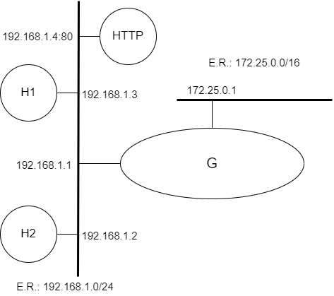

# Camada de Enlace (ARP)

[Baixar como PDF](files/debian/Pratica_de_Laboratorio_07.pdf)


<p align="center" style="font-family:Trebuchet MS;">Prática de Laboratório 07</p>
<p align="center"><b>Camada de Enlace (ARP)</b></p>

## *Introdução*
Para o correto funcionamento de redes, alguns serviços de nível de camada de enlace são primordiais para a adequada cooperação da pilha de protocolos sobre a qual reside a Internet.

## *Objetivos*
1. Exercitar conceitos referentes à camada de enlace.
2. Entender o papel do protocolo ARP e como acontecem suas interações.

## *Teoria abordada no experimento*
Objetivo e funcionamento do esquema ARP.

## *Material Necessário*
- Interfaces de rede (NIC's)
- Máquinas com sistema GNU/Linux
- Cabos de rede – par trançado normal
- Switches ou HUBs
- Software nas máquinas: ambiente GNU/Linux básico
- Acesso à Internet – NÃO é necessário
- Desligar o servidor DHCP para as máquinas de aula

## *Roteiro*
### 1. Montagem de rede interconectada para o experimento
Monte uma topologia com 3 ou mais máquinas. Escolha uma para ser o gateway da topologia e lhe dê dois endereços de IP: um IP fixo e válido para a rede de saída e um IP restrito, inválido.

Além dessa topologia, haverá equipamentos que proverão os serviços necessários às práticas da aula: HTTP.

- H1 (192.168.1.3), H2 (192.168.1.2) e G/eth0 (192.168.1.1).
- S1 (172.25.0.2) e G/eth1 (172.25.0.1).

<p align="center">
  
</p>

### 2. Configurar os clientes na rede de testes e validar as configurações
Certifique-se que eventuais serviços de suporte às configurações de rede estejam desativados.

Lembrem-se das etapas que foram percorridas na **Prática de Laboratório 01**.

### 3. Verificação das entradas presentes na tabela ARP
Em uma janela distinta, dispare a ferramenta de captura de pacotes:
```bash
$ tcpdump -e
```

Execute o seguinte comando:
```bash
$ arp -a
```

Proceda apenas se não constarem entradas na tabela ARP ou se constar apena a entrada do endereço MAC do gateway da rede de testes.

Em seguida, encontre algum equipamento da rede em que esteja sendo provido um serviço, como um servidor HTTP (porta 80), por exemplo. Anote o IP do host e execute o seguinte comando:
```bash
$ telnet ip_do_host porta_do_servico
```

Repita o comando arp:
```bash
$ arp -a
```

Tente, nessa etapa, a conexão a um IP não existente na rede.
```bash
$ telnet ip_do_host_inexistente porta_do_servico
```
Em seguida, repita o comando arp.

## *Questões para Estudo*
1. Qual foi a diferença de saídas observadas entre a primeira e as duas últimas chamadas ao comando ARP?
2. Suponha que uma aplicação utilize um esquema de controle de acesso baseado no valor do MAC address das placas de rede. Haveria algum problema de segurança nessa abordagem? Justifique.
3. É possível que o protocolo ARP interfira no desempenho de uma rede? Elabore sua resposta, apresentando exemplos/justificativas.
4. Há, na literatura, ataques que envolvem o protocolo ARP? Se a resposta for afirmativa, cite exemplos.

## *Referências Bibliográficas*
Geeksforgeeks.org. How Address Resolution Protocol (ARP) works?. GeeksForGeeks, 2022. Disponível em: https://www.geeksforgeeks.org/how-address-resolution-protocol-arp-works/. Acesso em: 16 dez. de 2022.

FreeBSD.org. arp. Data desconhecida. FreeBSD Manual Pages. Disponível em: https://www.freebsd.org/cgi/man.cgi?query=arp. Acesso em: 16 dez. 2022.

WETHERALL, D. J; TANENBAUM, A. S. Computer networks. Pearson Education, 2013.

LUCAS, M. W. Networking for Systems Administrators. 5th. ed. USA: Tilted Windmill Press, 2019.