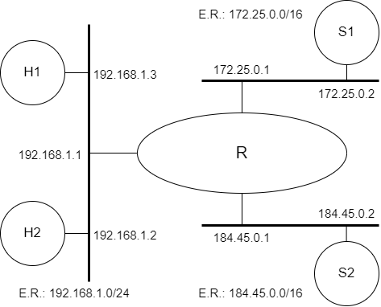

# *Operação e Proteção de Redes (Firewall)*


<p align="center" style="font-family:Trebuchet MS;" class="header">Prática de Laboratório 08</p>
<p align="center"><b><i>Firewall</i></b></p>

## *Introdução*
*Firewall* é uma solução de segurança baseada em *hardware* ou *software* (mais comum) que, a partir de um conjunto de regras ou instruções, analisa o tráfego de rede para determinar quais operações de transmissão ou recepção de dados podem ser executadas. "Parede de fogo", a tradução literal do nome, já deixa claro que o *firewall* se enquadra em uma espécie de barreira de defesa. A sua missão, por assim dizer, consiste basicamente em bloquear tráfego de dados indesejado e liberar acessos bem-vindos.

## *Objetivos*
1. Entender como funciona a implementação de *firewalls* usando o Linux.

## *Teoria abordada no experimento*
Objetivo e funcionamento de *firewalls*.

## *Material Necessário*
- Interfaces de rede (NIC's)
- Máquinas com sistema GNU/Linux
- Cabos de rede – par trançado normal
- Switches ou HUBs
- Software nas máquinas: ambiente GNU/Linux básico
- Acesso à Internet – NÃO é necessário

## *Roteiro*
### 1. Montagem de rede interconectada para o experimento
Monte uma topologia com 3 ou mais máquinas. Escolha uma para ser o gateway da topologia e lhe dê dois endereços de IP: um IP fixo e válido para a rede de saída e um IP restrito, inválido.

Os equipamentos H1 e S1 deverão prover o serviço SSH na porta 22.

<t style="color: green;">DICA:</t> Use as configurações e topologia utilizadas na **Prática de Laboratório 06**.

<!-- - R/eth1 (172.25.0.1) e S1 (172.25.0.2).
- H1 (192.168.1.3), H2 (192.168.1.2) e R/eth0 (192.168.1.1).
- **OPCIONAL**: R/eth2 (184.45.0.1) e S2 (184.45.0.2).


<p align="center">
  
</p> -->

### 2. Configurar os clientes na rede de testes e validar as configurações
Certifique-se que eventuais serviços de suporte às configurações de rede estejam desativados.

Lembrem-se das etapas que foram percorridas na **Prática de Laboratório 01**.

### 3. Configuração de regras de filtragem: Etapa 1
Em R, montar as seguintes regras:

- H1 pode apenas fazer ping em S1.
    - Apenas pacotes ICMP ping poderão se encaminhados de H1 para S1.
<!-- ```bash
$ iptables -A FORWARD -p icmp --icmp-type echo-request -s 192.168.1.3 -d 172.25.0.2 -j ACCEPT
$ iptables -A FORWARD -s 192.168.1.3 -d 172.25.0.2 -j DROP
``` -->

- S1 não pode fazer ping em H1.
    - Todos os pacotes de S1 deverão alcançar H1, exceto os de ICMP ping request.
<!-- ```bash
$ iptables -A FORWARD -p icmp --icmp-type echo-request -s 172.25.0.2 -d 192.168.1.3 -j DROP
``` -->

### 4. Testes: Validação das intervenções da Etapa 1
Verificar se H1 faz ping em S1 e se S1 faz ping em H1 com as regras da questão anterior. 

Verificar se é possível abrir uma conexão SSH de H1 para S1.

Verificar se é possível abrir uma conexão SSH de S1 para H1.

Executar Nmap da seguinte maneira:

- varrer as portas de H1 usando S1 como origem.
- varrer as portas de S1 usando H1 como origem.

### 5. Configuração de regras de filtragem: Etapa 2
Crie regras em R de modo que H1 possa fazer SSH em S1, porém através de um esquema de DNAT, onde uma porta de R irá redirecionar o tráfego para a porta que provê SSH em S1. <!--(redirecionamento de porta: port forwarding)-->
<!-- ```bash
$ iptables -t nat -A PREROUTING -p tcp -s 192.168.1.3 --dport 2222 -j DNAT --to-destination 172.25.0.2:22
$ iptables -A FORWARD -p tcp -d 172.25.0.2 --dport 22 -m state --state ESTABLISHED,RELATED -j ACCEPT
$ iptables -A FORWARD -p tcp -s 192.168.1.3 --dport 2222 -j DROP

Lembre-se de salvar as regras com iptables-save e carregá-las com iptables-restore caso precise.
``` -->

Crie regras em R de modo que S1 não seja capaz de encaminhar pacotes UDP para o segmento de rede onde reside H1.
<!-- ```bash
$ iptables -A FORWARD -p udp -s 172.25.0.2 -d 192.168.1.0/24 -j DROP
``` -->
<t style="color: red;">ATENÇÃO:</t> É importante mencionar que as regras de <i>firewall</i> são baseadas na ordem de criação, então a ordem destas regras é importante para garantir que elas estejam funcionando corretamente.

### 6. Testes: Validação das intervenções da Etapa 2
Para testar as regras de filtragem UDP da Etapa 2, use o envio de consultas DNS para provocar a transmissão de pacotes DNS.

Experimente realizar a conexão SSH entre H1 e S1 usando a regra de DNAT criada.

<t style="color: red;">ATENÇÃO:</t> Para verificar o log do sistema, você pode usar o comando **tail -f /var/log/syslog | grep "iptables"** que irá exibir as mensagens de log geradas pelo sistema operacional.

## *Questões para Estudo*
<link rel="stylesheet" href="../../style.css">
<div class="main-block">
<form>
<div class="info">
<input style="width:49%" type="text" name="nome" placeholder="Nome" required>
<input style="width:49%" type="number" name="matricula" placeholder="Matrícula" required>
</div>
<p class="question">1. O serviço ssh é sobre o TCP ou UDP? Conferir com o tcpdump, simulando a situação onde S1 faz ssh em H1.</p>
<div>
<textarea rows="4" id="0"></textarea>
</div>
<p class="question">2. Em relação aos <a href="#4-testes-validacao-das-intervencoes-da-etapa-1">testes da Etapa 1</a> do roteiro, como é possível ao Nmap indicar a eventual presença de portas filtradas através do roteador R que atua como <i>Firewall</i>?</p>
<div>
<textarea rows="4" id="1"></textarea>
</div>
</form>
<button class="submit-btn" id="submit-btn" onclick="getInfos('{{teacher.email}}')">Enviar</button>
</div>
<script src="../../main.js"></script>

## *Referências Bibliográficas*
DELFINO, Pedro. IPTABLES: Aprenda Como Utilizar A Principal Ferramenta Para Implementar Firewall No Linux. Data desconhecida. Profissionais Linux. Disponível em: https://e-tinet.com/linux/firewall-iptables/. Acesso em: 15 jan. de 2023.

Wikipedia.org. Firewall. Data desconhecida. Wikipedia. Disponível em: https://pt.wikipedia.org/wiki/Firewall. Acesso em: 17 dez. de 2022.

MACEDO, R. T. Firewall com Iptables: Teoria e Prática. YouTube, 15 de jun. de 2021. Disponível em: https://www.youtube.com/watch?v=_xIuY_3EQ2o. Acesso em: 15 jan. de 2023.

REIS, Fábio. Firewall iptables no Linux - parte 01 - Tabelas, Cadeias e Regras. YouTube, 23 de dez. de 2014. Disponível em: https://www.youtube.com/watch?v=LJlJlLgkNxg. Acesso em: 15 jan. de 2023.

REIS, Fábio. Firewall iptables - Verificando e excluindo as regras e regra padrão da cadeia no Linux - parte 02. YouTube, 24 de dez. de 2014. Disponível em: https://www.youtube.com/watch?v=Sc2-4gL6gIg. Acesso em: 15 jan. de 2023.

REIS, Fábio. Firewall iptables - Algumas regras de uso geral I (ping, mac, ssh, IP) - vídeo 03. YouTube, 26 de dez. de 2014. Disponível em: https://www.youtube.com/watch?v=LJlJlLgkNxg. Acesso em: 15 jan. de 2023.

REIS, Fábio. Firewall iptables - Salvando e tornando as regras permanentes - vídeo 04. YouTube, 29 de dez. de 2014. Disponível em: https://www.youtube.com/watch?v=kV4h_RCYR6s. Acesso em: 15 jan. de 2023.

WETHERALL, D. J; TANENBAUM, A. S. Computer networks. Pearson Education, 2013.

LUCAS, M. W. Networking for Systems Administrators. 5th. ed. USA: Tilted Windmill Press, 2019.