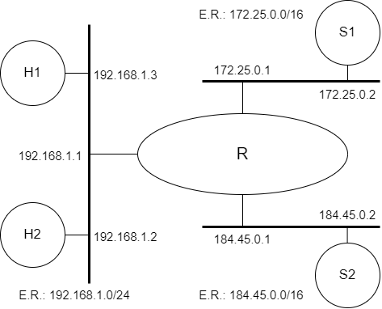

# Firewall

[Baixar como PDF](files/Pratica_de_Laboratorio_08.pdf)

Prática de Laboratório 08

<b>Firewall</b>

## *Introdução*
Firewall é uma solução de segurança baseada em hardware ou software (mais comum) que, a partir de um conjunto de regras ou instruções, analisa o tráfego de rede para determinar quais operações de transmissão ou recepção de dados podem ser executadas. "Parede de fogo", a tradução literal do nome, já deixa claro que o firewall se enquadra em uma espécie de barreira de defesa. A sua missão, por assim dizer, consiste basicamente em bloquear tráfego de dados indesejado e liberar acessos bem-vindos. [1]

## *Objetivos*
1. Entender como funciona a implementação de firewalls usando Linux ou FreeBSD.

## *Referências Teóricas*
Objetivo e funcionamento de firewalls.

## *Material Necessário*
- Interfaces de rede (NIC's)
- Máquinas com sistema FreeBSD
- Cabos de rede – par trançado normal
- Switches ou HUBs
- Software nas máquinas: ambiente FreeBSD básico
- Acesso à Internet – NÃO é necessário

## *Roteiro*
### 1. Montagem de rede interconectada para o experimento
- R/eth1(172.25.0.1) e S1 (172.25.0.2)
- H1 (192.168.133.2), H2 (192.168.133.3) e R/eth0(192.168.133.4). Segmento do LDS de interconexão com a **Internet**.
- **OPCIONAL**: R/eth2(184.45.0.1) e S2 (184.45.0.2)

Os equipamentos H1 e S1 deverão prover o serviço SSH na porta 22.

  

### 2. Configuração de regras de filtragem: Etapa 1
Em R, montar as seguintes regras:

- H1 pode apenas fazer ping em S1
    - Apenas pacotes ICMP ping poderão se encaminhados de H1 para S1.
- S1 não pode fazer ping em H1.
    - Todos os pacotes de S1 deverão alcançar H1, exceto os de ICMP ping request.

### 3. Testes: Validação das intervenções da Etapa 1
Verificar se H1 faz ping em S1 e se S1 faz ping em H1 com as regras da questão anterior. 

Verificar se é possível abrir uma conexão SSH de H1 para S1.

Verificar se é possível abrir uma conexão SSH de S1 para H1.

Executar Nmap da seguinte maneira:

- varrer as portas de H1 usando S1 como origem.
- varrer as portas de S1 usando H1 como origem.

### 4. Configuração de regras de filtragem: Etapa 2
Criar regrar em R de modo que H1 possa fazer SSH em S1, porém através de um esquema de DNAT, onde uma porta de R irá redirecionar o tráfego para a porta que provê SSH em S1.

Crie regras em R de modo que S1 não seja capaz de encaminhar pacotes UDP para o segmento de rede onde reside H1.

### 5. Testes: Validação das intervenções da Etapa 2
Para testar as regras de filtragem UDP da Etapa 2, use o envio de consultas DNS para provocar a transmissão de pacotes DNS.

Experimente realizar a conexão SSH entre H1 e S1 usando a regra de DNAT criada.

## *Questões para Estudo*
1. O serviço ssh é sobre o TCP ou UDP? Conferir com o tcpdump, simulando a situação onde S1 faz ssh em H1.
2. Em relação aos testes do Item 3 (testes da Etapa 1) do roteiro, como é possível ao Nmap indicar a eventual presença de portas filtradas através do roteador R que atua como Firewall?

## *Referências Bibliográficas*