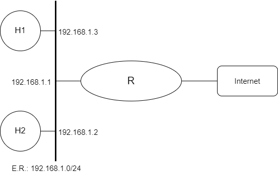
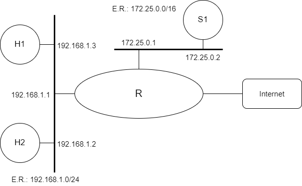

# Camada de Aplicação (Proxy)

[Baixar como PDF](files/Pratica_de_Laboratorio_09.pdf)

Prática de Laboratório 09

<b>Camada de Aplicação (Proxy)</b>

## *Introdução*
Em redes de computadores, um *proxy* é um servidor (um sistema de computador ou uma aplicação) que age como um intermediário para requisições de clientes solicitando recursos de outros servidores. 

Um cliente conecta-se ao servidor *proxy*, solicitando algum serviço, como um arquivo, conexão, página web ou outros recursos disponíveis de um servidor diferente e o *proxy* avalia a solicitação como um meio de simplificar e controlar sua complexidade. Os *proxies* foram inventados para adicionar estrutura e encapsulamento a sistemas distribuídos. Hoje, a maioria dos *proxies* é *proxy web*, facilitando o acesso ao conteúdo na World Wide Web e fornecendo anonimato. [1]

## *Objetivos*
1. Permitir que os alunos tenham contato com regras de Proxy em máquinas Linux.

## *Referências Teóricas*
Objetivo e funcionamento de um proxy de aplicação.

## *Material Necessário*
- Interfaces de rede (NIC's)
- Máquinas com sistema FreeBSD
- Cabos de rede – par trançado normal
- Switches ou HUBs
- Software nas máquinas: ambiente FreeBSD básico, pacote DNS server (bind9)
- Acesso à Internet – NÃO é necessário

## *Roteiro*
### 1. Montagem de rede interconectada para o experimento
Monte uma topologia de acordo com o seguinte diagrama:

  

### 2. Configuração dos equipamentos: etapa 1
Em R, instalar o SQUID (proxy server) com as seguintes funcionalidades: (i) controle de acesso web por máquina (IP), (ii) black list (BL) para h1 e h2, (iii) White list (wl) para h1 (e/ou h2). Na resposta, verificar e descrever qual o nível de prevalência entre wl e bl.

Ajustar h1 e h2 para que percebam a presença do proxy para o acesso Internet (configuração manual). **Obs.**: R possui acesso Internet, mas não possui NAT.

### 3. Configuração dos equipamentos: etapa 2
Montar a configuração de rede abaixo e seguir os requisitos descritos a seguir.

  

Transferir a função de proxy para S1, incluindo as restrições definidas nos itens (a) e (b).

Montar um SNAT em R para que S1 possa acessar a Internet.

Ajustar a tabela de rotas para que h1 e h2 consigam pingar em S1.

Montar regras em R (e onde for preciso) para garantir o proxy transparente (ou seja, h1 e h2 não sabem da presença de um proxy Obs.: Verificar se é possível resolver o desvio para o proxy usando um chain.

## *Questões para Estudo*
1. 
2. 

## *Referências Bibliográficas*