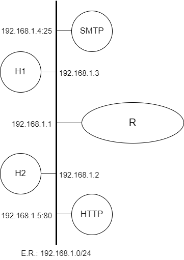

# Depuração de Problemas na Camada de Aplicação


<p align="center" style="font-family:Trebuchet MS;" class="header">Prática de Laboratório 02</p>
<p align="center"><b>Depuração de Problemas na Camada de Aplicação</b></p>

## *Introdução*
Quando um computador está devidamente configurado em uma rede de computadores, é interessante que ele se comunique com outros equipamentos para o provimento de serviços a usuários. Portanto, este experimento apresenta um conjunto mínimo de ferramentas que permitirão a execução de um diagnóstico preciso ao se encarar uma situação de interrupção ou instabilidade de serviço típico de camada de aplicação.

## *Objetivos*
1. Exercitar uma comunicação típica HTTP por meio de ferramenta de diagnóstico (**telnet**).
2. Exercitar o início de uma comunicação típica SMTP por meio de ferramenta de diagnóstico (**telnet**).
3. Exercitar as configurações de rede, especialmente no que tange ao serviço de resolução de nomes.

## *Teoria abordada no experimento*
Funcionamento básico de uma rede TCP/IP.

Protocolos da Camada de Aplicação.

## *Material Necessário*
- Interfaces de rede (NIC's)
- Máquinas com sistema FreeBSD
- Cabos de rede – par trançado normal
- Switches ou HUBs
- Software nas máquinas: ambiente FreeBSD básico
- Acesso à Internet – NÃO é necessário
- Servidores HTTP, DNS e SMTP devidamente configurados
- Ferramentas de diagnóstico: **ifconfig**, **ping**, **host**, **telnet**

## *Roteiro*
### 1. Montagem de rede interconectada para o experimento
- H1 (192.168.1.3), H2 (192.168.1.2), H3 (192.168.1.4), H4 (192.168.1.5) e R/eth0 (192.168.1.1).

Nessa topologia, haverá equipamentos que proverão os serviços necessários às práticas da aula: DNS, HTTP e SMTP.

<p align="center">
  
</p>

### 2. Configurar os clientes na rede de testes e validar as configurações
Lembrem-se das etapas que foram percorridas na **Prática de Laboratório 01**.

### 3. Interações com o serviço de resolução de nomes (DNS)
Confira se seu equipamento é capaz de executar a resolução de nomes usando DNS. Para tanto execute:
```bash
$ host nome_do_host opt_servidor_dns
```
<t style="color: red;">ATENÇÃO:</t> O parâmetro **opt_servidor_dns** é opcional. Execute o comando sem indicar esse parâmetro inicialmente.

Pesquise sobre o arquivo **/etc/hosts** e seu papel no processo de resolução de nomes.

### 4. Interações com o serviço HTTP
Usando os conceitos que foram estudados sobre o protocolo HTTP, use a ferramenta **telnet** para obter um objeto de determinado site HTTP.
```bash
$ telnet nome_do_host numero_da_porta
```

Uma vez aberto o socket, envie o seguinte comando para obter o objeto **index.html**:
```
GET /index.html HTTP/1.1
```

Posteriormente, troque o comando GET pelo comando HEAD.

Indique também o nome de outro objeto e observe o resultado do comando.

### 5. Interações com o serviço SMTP
Usando os conceitos que foram estudados sobre o protocolo SMTP, use a ferramenta **telnet** para obter um objeto de determinado site HTTP.
```bash
$ telnet nome_do_host numero_da_porta
```

Uma vez aberto o socket, envie o seguinte comando para iniciar uma transação SMTP
```
HELO
```

**DESAFIO**: Usando os conceitos sobre Camada de Aplicação, use o comando **telnet** para enviar um e-mail a um usuário de determinado servidor de e-mail.

## *Questões para Estudo*
<link rel="stylesheet" href="../../style.css">
<div class="main-block">
<form>
<div class="info">
<input style="width:49%" type="text" name="nome" placeholder="Nome" required>
<input style="width:49%" type="number" name="matricula" placeholder="Matrícula" required>
</div>
<p class="question">1. Em relação ao serviço de resolução de nomes, há um parâmetro opcional a ser indicado ao comando <b>host</b>. Em que contexto é conveniente indicar um valor para esse parâmetro?</p>
<div>
<textarea rows="4" id="0"></textarea>
</div>
<p class="question">2. Qual é o papel do arquivo <b>/etc/hosts</b> no processo de resolução de nomes?</p>
<div>
<textarea rows="4" id="1"></textarea>
</div>
<p class="question">3. Em relação às interações com o protocolo HTTP, foi possível identificar o cabeçalho de uma requisição típica? Em relação às respostas do servidor, identifique os campos típicos da resposta incluindo descrições sobre as linhas de cabeçalho e o campo de payload.</p>
<div>
<textarea rows="4" id="2"></textarea>
</div>
<p class="question">4. Em vários dos protocolos ora estudados, foi presenciada uma etapa de autorização que preparava uma sessão para a recepção de comandos de determinado cliente. O SMTP demonstrou-se um protocolo que não demanda uma etapa de autorização. Em que momento isso acontece? O fato de essa etapa ser suprimida resulta em algum risco para um serviço de e-mail?</p>
<div>
<textarea rows="4" id="3"></textarea>
</div>
</form>
<button class="submit-btn" id="submit-btn" onclick="getInfos('{{teacher.email}}')">Enviar</button>
</div>
<script src="../../main.js"></script>

## *Referências Bibliográficas*
Brasil, HSC. Saiba o que é e como funciona o protocolo SMTP. hscbrasil, 2019. Disponível em: https://www.hscbrasil.com.br/protocolo-smtp/. Acesso em: 11 dez. de 2022.

Costa, Matheus. O que é HTTP. canaltech, 2019. Disponível em: https://canaltech.com.br/internet/o-que-e-http/. Acesso em: 11 dez. de 2022.

Reynolds, Luke. Send an email using Telnet. linuxconfig, 2021. Disponível em: https://linuxconfig.org/send-an-email-using-telnet. Acesso em: 11 dez. de 2022.

FreeBSD.org. host(1). Data desconhecida. FreeBSD Manual Pages. Disponível em: https://www.freebsd.org/cgi/man.cgi?query=host&sektion=1. Acesso em: 11 dez. 2022.

FreeBSD.org. telnet(1). Data desconhecida. FreeBSD Manual Pages. Disponível em: https://www.freebsd.org/cgi/man.cgi?telnet. Acesso em: 11 dez. 2022.

LUCAS, M. W. Networking for Systems Administrators. 5th. ed. USA: Tilted Windmill Press, 2019.