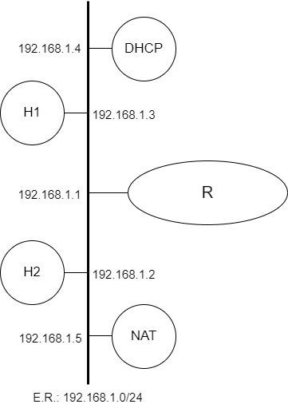

# Depuração de Problemas na Camada de Internet


<p align="center" style="font-family:Trebuchet MS;" class="header">Prática de Laboratório 04</p>
<p align="center"><b>Depuração de Problemas na Camada de Internet</b></p>

## *Introdução*
Uma vez devidamente configurado, um equipamento que se comunica através de uma rede de computadores como a Internet, se faz útil ao interagir com outros equipamentos para o provimento de serviços a usuários.

O estudo sobre a Camada de Internet introduz vários protocolos que tipicamente dão suporte às aplicações em rede, que, por sua vez, provêm os
serviços que usamos diariamente.

O conjunto de protocolos que cooperam no provimento dos serviços típicos de camada de internet podem ser separados em duas categorias: protocolos que geram tabelas de encaminhamento, os protocolos de roteamento, e os protocolos que utilizam as tabelas de encaminhamento.

Antes de serem introduzidas ferramentas de inspeção de protocolos de diferentes camadas, faz-se necessário apresentar ao estudante um conjunto mínimo de ferramentas que permitirão a execução de um diagnóstico preciso ao se encarar uma situação de interrupção ou instabilidade de serviço típico da camada de internet.

## *Objetivos*
1. Exercitar as configurações básicas para navegabilidade em uma rede de computadores bem como usar ferramentas de diagnóstico para validar configurações.
2. Exercitar os princípios básicos de uma comunicação em redes TCP/IP, com ênfase nos serviços típicos da camada de internet. Conhecer e manipular ferramentas de diagnóstico (**ping**, **ifconfig**, **traceroute**, **netstat** e **route**) para fixação de conceitos da camada de internet.

## *Teoria abordada no experimento*
Funcionamento básico de uma rede TCP/IP.

Protocolos de Camada de Internet.

## *Material Necessário*
- Interfaces de rede (NIC's)
- Máquinas com sistema FreeBSD
- Cabos de rede – par trançado normal
- Switches ou HUBs
- Software nas máquinas: ambiente FreeBSD básico
- Acesso à Internet – NÃO é necessário
- Servidores HTTP, DNS e SMTP devidamente configurados
- Ferramentas de diagnóstico: **ping**, **ifconfig**, **traceroute**, **netstat** e **route**

## *Roteiro*
### 1. Montagem de rede interconectada para o experimento
- H1 (192.168.1.3), H2 (192.168.1.2), H3 (192.168.1.4), H4 (192.168.1.5) e R/eth0 (192.168.1.1). 

Além dessa topologia, haverá equipamentos que proverão os serviços necessários às práticas da aula: DHCP e NAT.

<p align="center">
  
</p>

### 2. Configurar os clientes na rede de testes e validar as configurações
Lembrem-se das etapas que foram percorridas na **Prática de Laboratório 01**.

### 3. Conferência de informações sobre interfaces de rede
Usando um dos computadores disponíveis para o experimento e usando privilégios administrativos, execute a aplicação **ifconfig**. 

Quando executada sem parâmetros, essa aplicação irá retornar uma tabela de informações em que a primeira coluna possui um código que identifica a interface de rede. Por sua vez, a segunda coluna apresenta informações específicas sobre o enlace e sobre a rede à qual está conectada a interface.

### 4. Interações com outros clientes conectados à mesma rede
No primeiro experimento prático, pudemos exercitar alguns comandos, porém sem conhecer o princípio de funcionamento dos mesmos.

Um desses comandos (o mais intuitivo deles) foi o comando **ping**. Repitamos a execução do mesmo comando nessa prática. Sugiro identificar na rede de testes o IP de um equipamento ativo para, em seguida, executar o comando:
```bash
$ ping ip_do_host
```

### 5. Tabela de encaminhamento
Às vezes, faz-se necessário verificar qual é o caminho que poderá ser seguido por um pacote em uma comunicação típica através de uma rede TCP/IP. Ainda no equipamento emissor, pode ser necessária a conferência da tabela de encaminhamento em vigência. O sistema operacional FreeBSD provê algumas ferramentas que permitem a conferência da tabela de encaminhamento ativa.

O comando **netstat** é uma dessas ferramentas. Essa aplicação possui uma opção que indica ao usuário quais são as informações constantes na tabela de encaminhamento. Execute o seguinte comando com acesso administrativo:
```bash
$ netstat -nr
```

O retorno será uma tabela com 8 colunas devidamente identificadas. Você consegue perceber a repetição de algumas informações contidas na saída desse comando quanto comparada com a saída do **ifconfig**?

Para conferir o estado de atividade das interfaces de rede:
```bash
$ netstat -i
```

### 6. Caminho seguido por um pacote
Há uma aplicação que exercita os serviços típicos e protocolos da camada de forma a identificar o caminho seguido por um pacote. Esse tipo de informação é muito útil para um administrador de redes de computadores que necessita validar a execução de suas intervenções no esquema de roteamento seguido por um sistema autônomo.

Porém, dependendo do tipo da instituição que se comunica através de um sistema autônomo de roteamento, a informação do caminho seguido pelo pacote pode classificada como sensível. Dessa forma, o acesso deverá ser restrito àqueles que dela dependem sustentar o funcionamento do sistema autônomo. Naturalmente, outros usuários não deverão ser capazes de extrair essa informação de forma trivial a partir de interações com a rede.

A ferramenta de diagnóstico explorada nessa etapa chama-se **traceroute**. Por meio de interações com mecanismos típicos da camada de internet e da camada de transporte, essa ferramenta consegue extrair de redes qual o caminho percorrido por determinado pacote. Para tanto, basta que seu usuário indique um ip alvo para que a aplicação realize o processo de traçado da rota.
```bash
$ traceroute ip_do_alvo
```

## *Questões para Estudo*
<link rel="stylesheet" href="../../style.css">
<div class="main-block">
<form>
<div class="info">
<input style="width:49%" type="text" name="nome" placeholder="Nome" required>
<input style="width:49%" type="number" name="matricula" placeholder="Matrícula" required>
</div>
<p class="question">1. A descrição de informações específicas sobre a interface de rede obtida através da execução do comando <b>ifconfig</b> é bem extensa. Partindo do resultado da execução do comando em seu equipamento e tomando como referência a interface que foi usada nos testes, descreva em detalhes o significado de cada um dos itens discriminados na segunda coluna de saída do comando.</p>
<div>
<textarea rows="4" id="0"></textarea>
</div>
<p class="question">2. Equipamentos que implementam a pilha de protocolos TCP/IP apresentam, tipicamente, uma saída padrão durante a execução do comando <b>ifconfig</b>. Indique que saída é essa e como ela se faz útil na construção de sistemas que funcionarão sobre redes de comunicações.</p>
<div>
<textarea rows="4" id="1"></textarea>
</div>
<p class="question">3. A execução do comando <b>ping</b> em uma rede é uma das primeiras medidas para verificação de continuidade de serviço. Embora seja um comando muito simples de invocar e cujos resultados práticos são muito fáceis de interpretar, a riqueza de detalhes da saída típica de execução do <b>ping</b> é grande. Descreva cada um dos itens que compõem a saída de execução típica de um comando <b>ping</b>.</p>
<div>
<textarea rows="4" id="2"></textarea>
</div>
<p class="question">4. Em relação à <a href="#5-tabela-de-encaminhamento">etapa 5</a> do presente roteiro, descreva cada um dos itens que compõem a saída de execução típica de um comando <b>netstat -nr</b>.</p>
<div>
<textarea rows="4" id="3"></textarea>
</div>
<p class="question">5. Em relação à <a href="#6-caminho-seguido-por-um-pacote">etapa 6</a> do presente roteiro, descreva o processo típico de detecção da rota percorrida por um pacote através da execução do comando <b>traceroute</b>.</p>
<div>
<textarea rows="4" id="4"></textarea>
</div>
</form>
<button class="submit-btn" id="submit-btn" onclick="getInfos('{{teacher.email}}')">Enviar</button>
</div>
<script src="../../main.js"></script>

## *Referências Bibliográficas*
FreeBSD.org. ping(8). Data desconhecida. FreeBSD Manual Pages. Disponível em: https://www.freebsd.org/cgi/man.cgi?ping(8). Acesso em: 10 dez. 2022.

FreeBSD.org. traceroute. Data desconhecida. FreeBSD Manual Pages. Disponível em: https://www.freebsd.org/cgi/man.cgi?query=traceroute. Acesso em: 12 dez. 2022.

FreeBSD.org. netstat. Data desconhecida. FreeBSD Manual Pages. Disponível em: https://www.freebsd.org/cgi/man.cgi?netstat. Acesso em: 12 dez. 2022.

FreeBSD.org. route. Data desconhecida. FreeBSD Manual Pages. Disponível em: https://www.freebsd.org/cgi/man.cgi?route. Acesso em: 12 dez. 2022.

LUCAS, M. W. Networking for Systems Administrators. 5th. ed. USA: Tilted Windmill Press, 2019.