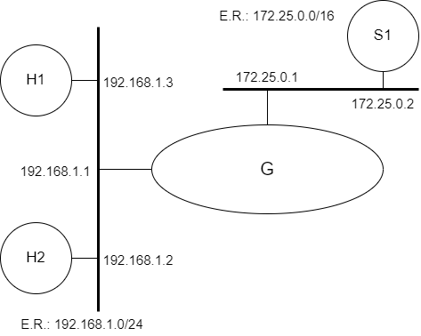

# Camada de Internet (NAT)

[Baixar como PDF](files/Pratica_de_Laboratorio_06.pdf)


<p align="center" style="font-family:Trebuchet MS;">Prática de Laboratório 06</p>
<p align="center"><b>Camada de Internet (NAT)</b></p>

## *Introdução*
Para o correto funcionamento de redes, alguns serviços de nível de aplicação complementam as funções básicas de rede, oferecendo funcionalidades que facilitam a administração da rede. Em função da escassez de endereços IPv4, os projetistas de Internet desenvolveram artifícios que permitiam um reúso de IPs. O primeiro conceito envolvido nesse tipo de técnica é o da segregação do espaço de endereçamento entre endereços IPs válidos e endereços de IPs de aplicação restrita. O NAT (Network Address Translation) é um esquema que torna viável montar uma rede endereçada por meio de um conjunto de IPs restritos de forma que todos os hosts compartilham um número pequeno de IPs válidos e, ainda sim, são capazes de manter conexões regulares com equipamentos na Internet.

## *Objetivos*
1. Visualizar a importância dos serviços de compartilhamento de IPs.
2. Entender como funciona a implementação do NAT no FreeBSD, e configurá-la.

## *Teoria abordada no experimento*
Objetivo e funcionamento do esquema ARP.

## *Material Necessário*
- Interfaces de rede (NIC's)
- Máquinas com sistema FreeBSD
- Cabos de rede – par trançado normal
- Switches ou HUBs
- Software nas máquinas: ambiente FreeBSD básico
- Acesso à Internet – NÃO é necessário
- Desligar o servidor DHCP para as máquinas de aula

## *Roteiro*
### 1. Montagem de rede interconectada para o experimento
Monte uma topologia com 3 ou mais máquinas. Escolha uma para ser o gateway da topologia e lhe dê dois endereços de IP: um IP fixo e válido para a rede de saída e um IP restrito, inválido.

- H1 (192.168.1.3), H2 (192.168.1.2) e G/eth0 (192.168.1.1).
- S1 (172.25.0.2) e G/eth1 (172.25.0.1).

<p align="center">
  
</p>

### 2. Configuração do Servidor DHCP (opcional)
Se for do interesse da equipe que executa o experimento evitar configurações nas máquinas que usarão o gateway com NAT, é conveniente implantar o serviço de DHCP em algum servidor da rede local (privada) que usará o equipamento com NAT como gateway.

Lembrem-se das etapas que foram percorridas na **Prática de Laboratório 05**.

### 3. Configuração do NAT
No FreeBSD, configure o arquivo rc.conf (**/etc/rc.conf**), do gateway, citado em experiências anteriores e ponha uma interface em questão, a interface de saída, configurada de forma fixa usando um IP válido da rede de saída. Use o comando **ifconfig** para verificar o endereço configurado.

Em seguida, crie uma rede privada e configure o IP da outra interface de rede do equipamento gateway para que possua o primeiro IP do espaço de endereçamento privado. Caso tenha optado por instalar DHCP nesta interface, não será necessária a configuração dos clientes que acessarão a rede externa através do NAT; se esse não for seu caso, configure uma máquina cliente de testes no espaço de endereçamento da rede privada recém criada e conecte o cliente ao servidor NAT.

Edite o arquivo sysctl.conf (**/etc/sysctl.conf**) para ativar o encaminhamento de pacotes IP (IP *forwarding*), descomente a seguinte linha:
```
net.inet.ip.forwarding=1
```

Ative a configuração.
```bash
$ sysctl net.inet.ip.forwarding=1
```

### 4. Configuração do Packet Filter (PF)
Identifique as interfaces configuradas no passo acima e realize os ajustes adequados. Doravante, chamaremos **ethSaida** a interface de saída e **ethPriv** a interface interna (com ou sem DHCP).

Realize a limpeza de eventuais regras de firewall presentes no equipamento, adicione as regras de NAT e de forwarding no ipfw:
```bash
$ pfctl -F all
pfctl -t nat -F
pfctl -X
pfctl -t nat -X
pfctl -t nat -A POSTROUTING -o ethSaida -j MASQUERADE -m state --state RELATED,ESTABLISHED -j ACCEPT
pfctl -A FORWARD -i ethPriv -o ethSaida -j ACCEPT
```

Inicie o serviço de natd:
```bash
$ natd -f /etc/natd.conf -s
```

<!-- 
Adicione uma rota para a rede de saída, para que as máquinas da rede privada saibam qual é o próximo salto para acessar a Internet. Isso pode ser feito adicionando a seguinte linha ao arquivo /etc/rc.conf:
```bash
$ route_<interface_de_entrada>="-net <rede_de_saida> <gateway_da_rede_de_saida> <mascara_de_rede>"
```

ou

Adicione uma regra no firewall (ipfw) para liberar o tráfego de saída na interface de entrada (em1) para a rede de saída (em0)
```bash
$ route_<interface_de_entrada>="-net <rede_de_saida> <gateway_da_rede_de_saida> <mascara_de_rede>"
```


-->

Teste as configurações de rede usando as ferramentas discutidas em práticas anteriores. Recomenda-se as seguintes etapas de testes: teste de conectividade entre equipamentos da rede privada e o gateway com NAT, teste de conectividade entre equipamentos da rede privada e equipamentos situados na rede de saída do gateway e teste de conectividade entre equipamentos da rede privada e equipamentos na Internet.

## *Questões para Estudo*
1. Alguns passos foram omitidos nesse roteiro. A partir da metodologia de testes, identifique o problema e apresente a solução para que a rede privada recém criada seja capaz de conectar-se à Internet.
2. Consulte a documentação das ferramentas usadas na implementação do NAT e indique o resultado de cada um dos comandos necessários à implementação do NAT.
3. Como você sugere verificar se está acessando a Internet através de um NAT?
4. Reinicie o seu equipamento usado para a implementação de um NAT usando o sistema operacional Linux e verifique se as suas configurações ainda funcionam. Descreva que tipo de procedimentos foram realizados para tornar as configurações de NAT persistentes.
5. Utilizando o sistema operacional FreeBSD, quais serão as etapas necessárias para a implementação de um NAT de comportamento semelhante ao que foi implementado em sala de aula com o Linux?

## *Referências Bibliográficas*