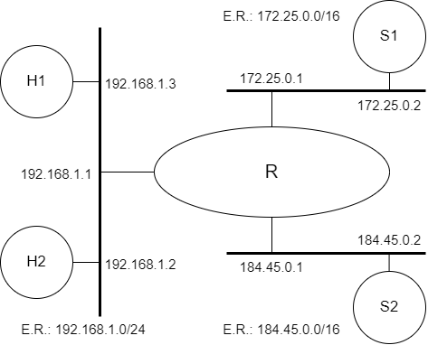

# *Firewall*

[Baixar como PDF](files/Pratica_de_Laboratorio_08.pdf)


<p align="center" style="font-family:Trebuchet MS;">Prática de Laboratório 08</p>
<p align="center"><b><i>Firewall<i></b></p>

## *Introdução*
*Firewall* é uma solução de segurança baseada em *hardware* ou *software* (mais comum) que, a partir de um conjunto de regras ou instruções, analisa o tráfego de rede para determinar quais operações de transmissão ou recepção de dados podem ser executadas. "Parede de fogo", a tradução literal do nome, já deixa claro que o *firewall* se enquadra em uma espécie de barreira de defesa. A sua missão, por assim dizer, consiste basicamente em bloquear tráfego de dados indesejado e liberar acessos bem-vindos. [[1](https://pt.wikipedia.org/wiki/Firewall)]

IPFW é um *firewall* de pacotes do sistema operacional FreeBSD. Ele fornece controles detalhados para os pacotes IP que passam pelo *firewall*. Com ele, é possível criar regras para permitir ou negar pacotes com base em critérios como origem, destino, porta, protocolo, tempo de execução, prioridade e muito mais. É possível criar regras para permitir ou negar o acesso a serviços específicos ou a segmentos da rede. IPFW também suporta o NAT (Network Address Translation) para permitir o uso de endereços IP privados em uma rede pública.

## *Objetivos*
1. Entender como funciona a implementação de *firewalls* usando o FreeBSD.

## *Teoria abordada no experimento*
Objetivo e funcionamento de *firewalls*.

## *Material Necessário*
- Interfaces de rede (NIC's)
- Máquinas com sistema FreeBSD
- Cabos de rede – par trançado normal
- Switches ou HUBs
- Software nas máquinas: ambiente FreeBSD básico
- Acesso à Internet – NÃO é necessário

## *Roteiro*
### 1. Montagem de rede interconectada para o experimento
- R/eth1 (172.25.0.1) e S1 (172.25.0.2).
- H1 (192.168.1.3), H2 (192.168.1.2) e R/eth0 (192.168.1.1).
- **OPCIONAL**: R/eth2 (184.45.0.1) e S2 (184.45.0.2).

Os equipamentos H1 e S1 deverão prover o serviço SSH na porta 22.

<p align="center">
  
</p>

### 2. Configurar os clientes na rede de testes e validar as configurações
Lembrem-se das etapas que foram percorridas na **Prática de Laboratório 01**.

### 3. Habilitar o IPFW
Primeiramente, é necessário verificar se o IPFW já se encontra habilitado. Para isso, execute o seguinte comando:
```bash
$ ipfw show
```
<t style="color: red;">ATENÇÃO:</t> Caso a resposta seja **Protocol not available**, significa que não está habilitado.

Existem duas formas de habilitar o IPFW, via módulo ou via kernel. 

#### 3.1 Habilitar IPFW via módulo
Para habilitar o IPFW via módulo:
```bash
$ kldload ipfw
```
<t style="color: red;">ATENÇÃO:</t> Ao habilitar o módulo, o padrão será uma regra de política fechada: ou seja, a primeira regra é "negar tudo". Para transformar essa política em aberta, ou seja, que a primeira regra seja "permitir tudo", deve-se alterar a sysctl com o seguinte comando:
```bash
$ sysctl net.inet.ip.fw.default_to_accept=1
```

#### 3.2 Habilitar IPFW via kernel 
Para habilitar o IPFW via kernel, configure o arquivo rc.conf (**/etc/rc.conf**), adicionando a seguinte linha ao arquivo:
```
firewall_enable="YES"
```

Depois, basta executar o comando:
```bash
$ service ipfw start
```

### 4. Configuração de regras de filtragem: Etapa 1
Em R, montar as seguintes regras:

- H1 pode apenas fazer ping em S1.
    - Apenas pacotes ICMP ping poderão se encaminhados de H1 para S1.
```bash
$ # caso o padrão seja uma regra de política aberta
$ ipfw add 50 deny all from 192.168.1.3 to 172.25.0.2 not icmp
$ # permitir apenas pacotes ICMP
$ ipfw add 60 allow icmp from 192.168.1.3 to 172.25.0.2
```
<!-- ipfw add 100 allow icmp from 192.168.1.3 to 172.25.0.2 icmptype 8-->

- S1 não pode fazer ping em H1.
    - Todos os pacotes de S1 deverão alcançar H1, exceto os de ICMP ping request.
```bash
$ # negar apenas pacotes ICMP
$ ipfw add 70 deny icmp from 172.25.0.2 to 192.168.1.3
$ # caso o padrão seja uma regra de política fechada
$ ipfw add 80 allow all from 172.25.0.2 to 192.168.1.3 not icmp
```
<!-- ipfw add 200 deny icmp from 172.25.0.2 to 192.168.1.3 icmptype 8-->

### 5. Testes: Validação das intervenções da Etapa 1
Verificar se H1 faz ping em S1 e se S1 faz ping em H1 com as regras da questão anterior. 

Verificar se é possível abrir uma conexão SSH de H1 para S1.

Verificar se é possível abrir uma conexão SSH de S1 para H1.

Executar Nmap da seguinte maneira:

- varrer as portas de H1 usando S1 como origem.
- varrer as portas de S1 usando H1 como origem.

### 6. Configuração de regras de filtragem: Etapa 2
Crie regras em R de modo que H1 possa fazer SSH em S1, porém através de um esquema de DNAT, onde uma porta de R irá redirecionar o tráfego para a porta que provê SSH em S1. <!--(redirecionamento de porta: port forwarding)-->
```bash
$ ipfw add 90 fwd 172.25.0.2,22 tcp from 192.168.1.3 to me dst-port 22
$ ipfw add 100 allow tcp from 192.168.1.3 to 172.25.0.2 dst-port 22
```

Crie regras em R de modo que S1 não seja capaz de encaminhar pacotes UDP para o segmento de rede onde reside H1.
```bash
$ ipfw add 110 deny udp from 172.25.0.2 to 192.168.1.3
```
<t style="color: red;">ATENÇÃO:</t> É importante mencionar que as regras de <i>firewall</i> são baseadas na ordem de criação, então a ordem destas regras é importante para garantir que elas estejam funcionando corretamente.

### 7. Testes: Validação das intervenções da Etapa 2
Para testar as regras de filtragem UDP da Etapa 2, use o envio de consultas DNS para provocar a transmissão de pacotes DNS.

Experimente realizar a conexão SSH entre H1 e S1 usando a regra de DNAT criada.

<t style="color: red;">ATENÇÃO:</t> É possível verificar o log do <i>firewall</i> usando o comando **ipfw show log** ou **ipfw show log verbose** para obter informações adicionais, como endereços IP e portas. Para verificar o log do sistema, você pode usar o comando **tail -f /var/log/messages** ou **syslog** que irá exibir as mensagens de log geradas pelo sistema operacional.

## *Questões para Estudo*
1. O serviço ssh é sobre o TCP ou UDP? Conferir com o tcpdump, simulando a situação onde S1 faz ssh em H1.
2. Em relação aos testes do Item 4 (testes da Etapa 1) do roteiro, como é possível ao Nmap indicar a eventual presença de portas filtradas através do roteador R que atua como *Firewall*?

## *Referências Bibliográficas*
[1] https://pt.wikipedia.org/wiki/Firewall

https://www.youtube.com/watch?v=_tIP4E22O_0

https://docs.freebsd.org/en/books/handbook/firewalls/#firewalls-ipfw

https://sempreupdate.com.br/freebsd-como-configurar-um-firewall-usando-ipfw/