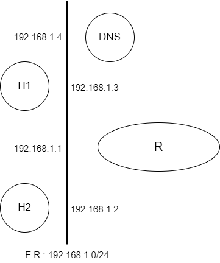

# Camada de Aplicação (DNS)


<p align="center" style="font-family:Trebuchet MS;">Prática de Laboratório 10</p>
<p align="center"><b>Camada de Aplicação (DNS)</b></p>

## *Introdução*
O Domain Name System (DNS) é um importante componente da Internet, responsável por fazer a tradução de nomes de domínio para endereços IP e vice-versa. Isso permite que os usuários acessem sites e serviços através de nomes de domínio, em vez de ter que digitar os endereços IP correspondentes.

## *Objetivos*
1. Demonstrar o funcionamento do DNS e sua importância na Internet.
2. Mostrar como configurar um servidor DNS no FreeBSD.
3. Verificar o funcionamento do servidor DNS através de consultas utilizando os comandos **dig** e **nslookup**.

## *Teoria abordada no experimento*
Objetivo e funcionamento do protocolo DNS.

## *Material Necessário*
- Interfaces de rede (NIC's)
- Máquinas com sistema FreeBSD
- Cabos de rede – par trançado normal
- Switches ou HUBs
- Software nas máquinas: ambiente FreeBSD básico, pacotes de servidor DNS (**bind9**)
- Acesso à Internet – NÃO é necessário
- Desligar o servidor DNS para as máquinas de aula

## *Roteiro*
### 1. Montagem de rede interconectada para o experimento
- H1 (192.168.1.3), H2 (192.168.1.2), H3 (192.168.1.4) e R/eth0 (192.168.1.1).

<p align="center">
  
</p>

### 2. Configurar os clientes na rede de testes e validar as configurações
Lembrem-se das etapas que foram percorridas na **Prática de Laboratório 01**.

### 3. Instalação do pacote de servidor DNS
Para a execução deste experimento é essencial a instalação do pacote **bind9**, que não é incluso por padrão no FreeBSD. Para prosseguir com a instalação, execute o seguinte comando:
```bash
$ pkg install bind916
```
Adicione a seguinte linha no arquivo rc.conf (**/etc/rc.conf**):
```
named_enable="YES"
```
E execute o comando:
```bash
$ service named start
```

Verifique se o servidor DNS está funcionando corretamente com o seguinte comando:
```bash
$ nslookup localhost
```

### 4. Configuração do Servidor DNS
Edite o arquivo de configuração do DNS, named.conf (**/usr/local/etc/namedb/named.conf**) e adicione as seguintes linhas para configurar as suas zonas de busca direta e inversa:
```
zone "exemplo.com" {
    type master;
    file "/usr/local/etc/namedb/master/exemplo.com.db";
};

zone "1.168.192.in-addr.arpa" {
    type master;
    file "/usr/local/etc/namedb/master/192.168.1.db";
};
```

Crie os arquivos de zona de busca direta e inversa. O arquivo de zona de busca direta, exemplo.com.db (**/usr/local/etc/namedb/master/exemplo.com.db**), deve conter informações sobre os seus servidores de nomes e endereços IP:
```
$TTL    86400
@       IN      SOA     ns1.exemplo.com. admin.exemplo.com. (
                        20201022      ;Serial
                        3600          ;Refresh
                        1800          ;Retry
                        604800        ;Expire
                        86400 )       ;Minimum TTL
;
@       IN      NS      ns1.exemplo.com.
@       IN      A       192.168.1.3
ns1     IN      A       192.168.1.3
www     IN      A       192.168.1.3
H1      IN      A       192.168.1.2
H2      IN      A       192.168.1.4
```

O arquivo de zona de busca inversa, 192.168.1.db (**/usr/local/etc/namedb/master/192.168.1.db**), deve conter informações sobre os seus endereços IP e nomes de host:
```
$TTL    86400
@       IN      SOA     ns1.exemplo.com. admin.exemplo.com. (
                        20201022      ;Serial
                        3600          ;Refresh
                        1800          ;Retry
                        604800        ;Expire
                        86400 )       ;Minimum TTL
;
@       IN      NS      ns1.exemplo.com.
2       IN      PTR     H1.exemplo.com.
3       IN      PTR     ns1.exemplo.com.
4       IN      PTR     H2.exemplo.com.
```

Reinicie o serviço DNS usando o seguinte comando: 
```bash
$ service named restart.
```

Faça consultas ao servidor DNS para verificar se está funcionando corretamente:
```bash
$ nslookup host_da_rede
```


### 5. Configuração do cliente DNS
Para que outros hosts da rede usem o servidor DNS que você configurou, é necessário especificar o endereço IP do servidor DNS como sendo o servidor de nomes padrão (ou *nameserver*) desses hosts.

No FreeBSD, configure o arquivo resolv.conf (**/etc/resolv.conf**) especificando o servidor de nomes padrão:
```
nameserver 192.168.1.4
```

Verifique se o host está usando o servidor DNS configurado, fazendo uma consulta.
```bash
$ nslookup host_da_rede
```

## *Questões para Estudo*
1. Como você faria para adicionar um registro MX (Mail Exchange) ao seu arquivo de zona de busca direta?
2. Como você faria para configurar uma zona secundária (slave) no seu servidor DNS?
3. Como você faria para monitorar e solucionar problemas comuns de desempenho em um servidor DNS, como consultas de DNS não autorizadas ou ataques de negação de serviço (DoS)?
4. Como você faria para configurar o seu servidor DNS para fornecer serviços de resolução de nomes para redes privadas usando NAT?

## *Referências Bibliográficas*
LEE, C; RHODES, T; GERZO, D. Domain Name System (DNS). Data desconhecida. FreeBSD Handbook. Disponível em: https://docs.freebsd.org/doc/7.4-RELEASE/usr/share/doc/handbook/network-dns.html. Acesso em: 19 dez. 2022.

OLIVEIRA, W. P. Instalando e configurando o Serviço DNS na rede com Linux com BIND9 - Parte 1. YouTube, 6 de abr. de 2021. Disponível em: https://www.youtube.com/watch?v=m1ffSGGRDb0. Acesso em: 19 dez. de 2022.

OLIVEIRA, W. P. Instalando e configurando o Serviço DNS na rede com Linux com BIND9 - Parte 2. YouTube, 7 de abr. de 2021. Disponível em: https://www.youtube.com/watch?v=SSzdIHGYSZw. Acesso em: 19 dez. de 2022.

OLIVEIRA, W. P. Instalando e configurando o Serviço DNS na rede com Linux com BIND9 - Parte 3. YouTube, 7 de abr. de 2021. Disponível em: https://www.youtube.com/watch?v=HHq7NbddFPg. Acesso em: 19 dez. de 2022.

WETHERALL, D. J; TANENBAUM, A. S. Computer networks. Pearson Education, 2013.

LUCAS, M. W. Networking for Systems Administrators. 5th. ed. USA: Tilted Windmill Press, 2019.