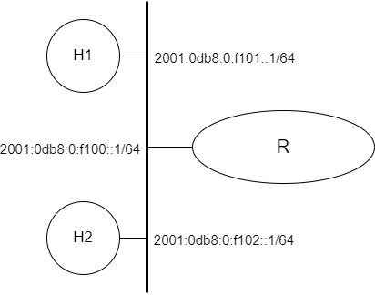

# Introdução ao IPv6

[Baixar como PDF](files/Pratica_de_Laboratorio_11.pdf)


<p align="center" style="font-family:Trebuchet MS;">Prática de Laboratório 11</p>
<p align="center"><b>Introdução ao IPv6</b></p>

## *Introdução*


## *Objetivos*
1. Compreender as configurações básicas para navegabilidade em uma rede de computadores utilizando o IPv6.
2. Exercitar configurações básicas e entender como usar ferramentas de diagnóstico para validar configurações.
3. Configurar o IPv6 no FreeBSD.

## *Teoria abordada no experimento*
Funcionamento básico de uma rede TCP/IP utilizando o IPv6.
Conceitos básicos do IPv6


## *Material Necessário*
- Interfaces de rede (NIC's)
- Máquinas com sistema FreeBSD
- Cabos de rede – par trançado normal
- Switches ou HUBs
- Software nas máquinas: ambiente FreeBSD básico
- Acesso à Internet – NÃO é necessário
- Desligar o servidor e cliente DHCP para as máquinas do experimento

## *Roteiro*
### 1. Montagem de rede interconectada para o experimento
- H1 (2001:0db8:0:f101::1/64), H2 (2001:0db8:0:f102::1/64) e R/eth0 (2001:0db8:0:f100::1/64).

<p align="center">
  
</p>

### 2. Configurar os clientes na rede de testes.
#### 2.1 Configuração manual usando *ifconfig(8)*
Para ver o estado atual da interface de rede que esta sendo usada na maquina, execute:
```bash
$ ifconfig <interface_nome>
```

Caso o comando mostre na saida a linha **nd6 options** com a opção **IFDISABLED**, significa que o IPv6 esta desabilitado nesta interface. Caso esteja desabilitado, execute o comando:
```bash
$ ifconfig <interface_nome> inet6 -ifdisabled
```

Após a habilitação, verifique novamente o estado atual da interface de rede. Deverá ser capaz de ver a linha inet6, que será o endereço IPv6 configurado para a interface em questão.

Envie pacotes icmp (**ping**) para testar a configuração:
```bash
$ ping <inet6_endereço>
```

Execute o serviço SSH no FreeBSD e faça um teste para verificar se é possivel conectar no SSH através do IPv6.
```bash
$ ssh -v <inet6_endereço>
```
<t style="color: red;">ATENÇÃO:</t> Este teste ira falhar caso o AddressFamily for limitado para inet no arquivo de configuração do sshd_config(8). Veja a saida de sockstat -6 | grep sshd para verificar se sshd(8) escuta o soquete IPv6.

#### 2.2 Endereços Multicast Úteis
Um endereço *Multicast* identifica um conjunto de interfaces, onde um pacote enviado a um endereço multicast é entregue a todas as interfaces associadas a esse endereço.

A seguir estão representados dois importantes endereços *Multicast*:

- ff02::1 - endereço multicast de todos os nós da rede no escopo link-local.
- ff02::2 - endereço multicast de todos os roteadores da rede no escopo link-local.

É possivel enviar pacotes ICMPv6 para visualizar os nós da rede que estão conectados no mesmo link:
```bash
$ ping ff02::1
```
<t style="color: red;">ATENÇÃO:</t> É necessário informar o identificador de zona no comando anterior. 

A partir das informações dadas, faça a mesma coisa para visualizar os roteadores que estão conectados no mesmo link.

#### 2.3 Configuração de host IPv6 
No IPv6 é possivel configurar mais de um endereço em uma única interface:
```bash
$ ifconfig <interface> inet6 fe80::1/64
```

Envie pacotes icmp (**ping**) para testar a configuração:
```bash
$ ping fe80::1/64
```

Execute o serviço SSH no FreeBSD e faça um teste para verificar se é possivel conectar no SSH através do IPv6.
```bash
$ ssh -v <inet6_endereço>
```

Para remover um endereço específico, pode-se usar o parametro *-alias*:
```bash
$ ifconfig <interface> inet6 fe80::1/64 -alias
```

#### 2.4 Configuração manual usando o arquivo *rc.conf*
Para configurar o IPv6 no arquivo rc.conf (**/etc/rc.conf**) utiliza-se o `ifconfig_<interface>_ipv6` para indicar que a interface `<interface>` é compativel com IPv6. Na seguinte seguinte configuração, apenas um endereço de link-local é configurado automaticamente:
```
ifconfig_bge0="inet 192.168.0.10/24"
ifconfig_bge0_ipv6="inet6 auto_linklocal"
```

Se você quiser adicionar outro endereço de link local manualmente, você pode adicionar a linha ``inet6`` em ``ifconfig_bge0_ipv6``.
```
ifconfig_bge0="inet 192.168.0.10/24"
ifconfig_bge0_ipv6="inet6 fe80::1/64"
```

Mais endereços podem ainda ser adicionados usando a linha ``ifconfig_bge0_alias0``:
```
ifconfig_bge0="inet 192.168.0.10/24"
ifconfig_bge0_ipv6="inet6 fe80::1/64"
ifconfig_bge0_alias0="inet6 2001:db8::1/64"
```

A partir dos exemplos dados até aqui, configure os endereços mencionados na topologia nos devidos hosts.

### 3. Validando as configurações
Confira a conectividade básica enviando pacotes ICMP para algum outro computador que esteja conectado à mesma rede:
```bash
$ ping <IP-address>
```

Confira as configurações de roteamento enviando pacotes ICMP para algum outro computador que esteja conectado à outra rede.
```bash
$ ping <IP-address>
```

Como proceder para configurar o esquema de resolução de nomes?

Obs.: Esse tipo de configuração explorada no experimento é chamada de **Manual** ou **Estática**.
### 

## *Questões para Estudo*
1. Em certo momento do experimento, bastou apenas executar o comando **ifconfig &lt;interface_nome&gt; inet6 -ifdisabled** para que um IPv6 fosse configurado. Porque ocorreu isso e como desativar essa configuração automatica?
2. O que é StateLess Address AutoConfiguration (SLAAC) e qual suautilidade na atribuição de endereços IPv6?
3. Explique os tipos de endereço IPv6 e seus respectivos prefixos? 

## *Referências Bibliográficas*

<!--
preciso de um experimento pratico de configuração de ipv6 no freebsd para ser aplicado na disciplina de redes de computadores de faculdade, o experimento deve ter as seguintes seções:
Introdução
Objetivos
Teoria abordada no experimento
Material Necessario
Roteiro (detalhado em passos que possuam titulo)
Questoes para estudo
Referencias bibliograficas
-->