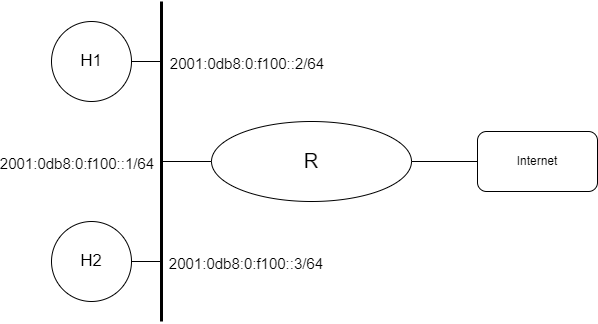

# Introdução ao IPv6


<p align="center" style="font-family:Trebuchet MS;" class="header">Prática de Laboratório 11</p>
<p align="center"><b>Introdução ao IPv6</b></p>

## *Introdução*
O IPv6 é o sucessor do IPv4 e foi criado para resolver os problemas de escassez de endereços IP que ocorriam no IPv4. Ele fornece uma quantidade praticamente ilimitada de endereços IP, permitindo que as redes cresçam e evoluam de forma mais flexível e escalável. Neste experimento prático, vamos explorar como configurar o IPv6 no sistema operacional FreeBSD através da utilização de comandos e configurações no arquivo rc.conf (**/etc/rc.conf**).

## *Objetivos*
1. Compreender as configurações básicas para navegabilidade em uma rede de computadores utilizando o IPv6.
2. Exercitar configurações básicas e entender como usar ferramentas de diagnóstico para validar configurações.

## *Teoria abordada no experimento*
Conceitos básicos do IPv6 e o funcionamento básico de uma rede TCP/IP utilizando o IPv6.

## *Material Necessário*
- Interfaces de rede (NIC's)
- Máquinas com sistema FreeBSD
- Cabos de rede – par trançado normal
- Switches ou HUBs
- Software nas máquinas: ambiente FreeBSD básico
- Acesso à Internet – necessário
- Desligar o servidor e cliente DHCP para as máquinas do experimento

## *Roteiro*
### 1. Montagem de rede interconectada para o experimento
- H1 (2001:0db8:0:f100::2/64), H2 (2001:0db8:0:f100::3/64) e R/eth0 (2001:0db8:0:f100::1/64).

<p align="center">
  
</p>

### 2. Configurar os clientes na rede de testes
#### 2.1 Configuração manual usando *ifconfig(8)*
Para ver o estado atual da interface de rede que esta sendo usada na maquina, execute:
```bash
$ ifconfig <interface>
```

Caso o comando mostre na saída a linha **nd6 options** com a opção **IFDISABLED**, significa que o IPv6 esta desabilitado nesta interface. Caso esteja desabilitado, execute o comando:
```bash
$ ifconfig <interface> inet6 -ifdisabled
```

Após a habilitação, verifique novamente o estado atual da interface de rede. Deverá ser capaz de ver a linha **inet6**, que será o endereço IPv6 configurado para a interface em questão.

Envie pacotes icmp (**ping**) para testar a configuração:
```bash
$ ping <inet6_address>
```

Execute o serviço SSH no FreeBSD e faça um teste para verificar se é possível conectar no SSH através do IPv6.
```bash
$ ssh -v <inet6_address>
```
<t style="color: red;">ATENÇÃO:</t> Este teste irá falhar caso o parâmetro <i>AddressFamily</i>, no arquivo de configuração do <b>sshd_config(8)</b>, estiver definido como <b>inet</b>. Veja a saída de <b>sockstat -6 | grep sshd</b> para verificar se SSH escuta o soquete IPv6.

#### 2.2 Endereços Multicast Úteis
Um endereço *Multicast* identifica um conjunto de interfaces, onde um pacote enviado a um endereço multicast é entregue a todas as interfaces associadas a esse endereço.

A seguir estão representados dois importantes endereços *Multicast*:

- ff02::1 - endereço multicast de todos os nós da rede no escopo link-local.
- ff02::2 - endereço multicast de todos os roteadores da rede no escopo link-local.

É possível enviar pacotes ICMPv6 para visualizar os nós da rede que estão conectados no mesmo link:
```bash
$ ping ff02::1
```
<t style="color: red;">ATENÇÃO:</t> É necessário informar o identificador de zona no comando anterior. 

A partir das informações dadas, faça a mesma coisa para visualizar os roteadores que estão conectados no mesmo link.

#### 2.3 Configuração de host IPv6 
No IPv6 é possível configurar mais de um endereço em uma única interface:
```bash
$ ifconfig <interface> inet6 fe80::1/64
```

Envie pacotes icmp (**ping**) para testar a configuração:
```bash
$ ping fe80::1/64
```

Execute o serviço SSH no FreeBSD e faça um teste para verificar se é possível conectar no SSH através do IPv6.
```bash
$ ssh -v <inet6_address>
```

Para remover um endereço específico, pode-se usar o parâmetro *-alias*:
```bash
$ ifconfig <interface> inet6 fe80::1/64 -alias
```

#### 2.4 Configuração manual usando o arquivo *rc.conf*
Para configurar o IPv6 no arquivo rc.conf (**/etc/rc.conf**) utiliza-se o parâmetro **ifconfig_&lt;interface&gt;_ipv6** para indicar que a interface **&lt;interface&gt;** é compatível com IPv6. Na seguinte configuração apenas um endereço de link-local é configurado automaticamente:
```
ifconfig_bge0_ipv6="inet6 auto_linklocal"
```

Se você quiser adicionar outro endereço de link-local manualmente, você pode adicionar a linha **inet6** em **ifconfig_&lt;interface&gt;_ipv6**.
```
ifconfig_bge0_ipv6="inet6 fe80::1/64"
```

Mais endereços podem ainda ser adicionados usando a linha **ifconfig_&lt;interface&gt;_alias0**:
```
ifconfig_bge0_ipv6="inet6 fe80::1/64"
ifconfig_bge0_alias0="inet6 2001:db8::1/64"
```

A partir dos exemplos dados até aqui, configure uma topologia semelhante a apresentada no inicio do experimento. Após configurar os endereços execute o seguinte comando para reconfigurar a interface:
```bash
$ service netif restart <interface>
```

<t style="color: red;">ATENÇÃO:</t> No FreeBSD a linha ```ifconfig_<interface>``` do arquivo rc.conf (**/etc/rc.conf**) não pode estar vazia, pois ela serve para dizer que a interface em questão está ativa. Caso não seja necessário ativar o ipv4 da maquina pode ser definido ```ifconfig_<interface>="up"```.

### 3. Validando as configurações
Confira a conectividade básica enviando pacotes ICMPv6 para algum outro computador que esteja conectado à mesma rede:
```bash
$ ping <inet6_address>
```

Como proceder para configurar o esquema de resolução de nomes?

### 4. Internet em IPv6
#### 4.1 Configuração manual
Ao configurar e validar uma topologia semelhante a apresentada no inicio do experimento, pode ter ficado a duvida de como acessar destinos fora da rede local. Para que isso seja possível primeiro é necessário adicionar a seguinte linha ao arquivo rc.conf (**/etc/rc.conf**):
```
ipv6_defaultrouter="<inet6_address>"
```

Esta variável especifica o roteador padrão.

Caso você não saiba o endereço ipv6 do seu roteador você pode executar comandos que foram explicados anteriormente neste experimento. Tente!

Após especificar o roteador padrão no arquivo é necessário reconfigurar a interface através do utilitário **service**, ja apresentado no presente experimento.

Verifique o estado atual da interface de rede:
```bash
$ ifconfig <interface>
```

Após configurado o endereço padrão do roteador você pode enviar pacotes ICMPv6 através da internet:
```bash
$ ping www.freebsd.org
```

Observe que a resolução de nomes de domínio DNS é executada pelos servidores de nomes listados em resolv.conf (**/etc/resolv.conf**). Se o seu roteador IPv6 funcionar como um proxy DNS, você pode colocar o endereço IPv6 assim:
```
nameserver <inet6_address>
```

#### 4.2 Configuração automática de endereço global (SLAAC)
O IPv6 possui recursos de configuração automática de endereço através de mensagens RA do roteador (protocolo NDP). É possível configurar um endereço IPv6 automaticamente, caso o seu roteador ofereça suporte às mensagens RA.

Para verificar se o seu roteador IPv6 oferece suporte a mensagens RA, você pode usar o utilitário **rtsol** com  um sinalizador **-D**. Ele envia uma mensagem RS e mostra as mensagens RA dos roteadores:
```bash
$ rtsol -D <interface>
```
Caso a resposta contenha a linha **received RA from**, significa que é possível utilizar a configuração automática. No arquivo rc.conf (**/etc/rc.conf**) atualizar o valor da variável **ifconfig_&lt;interface&gt;_ipv6**:
```
$ ifconfig_bge0_ipv6="inet6 accept_rtadv"
```
O valor **inet6 accept_rtadv** permite que a interface **bge0** aceite mensagens RA para configurar a interface.

Verifique o estado atual da interface de rede:
```bash
$ ifconfig <interface_nome>
```
A palavra-chave **autoconf** deve ser mostrada logo após o endereço.

<t style="color: red;">ATENÇÃO:</t> No caso da configuração automática, não é necessário definir o roteador padrão no arquivo rc.conf (<b>/etc/rc.conf</b>). Pois, o valor <b>inet6 accept_rtadv</b> configura um endereço IPv6 global e o roteador padrão.

### 6. Configuração de um roteador IPv6
A topologia a seguir mostra um exemplo de um rede que possui um roteador IPv6 para ter duas redes independentes. A LAN 1 e a LAN 2 são conectadas entre si pelo roteador, e outro roteador oferece acessibilidade à Internet IPv6.

- H1 (2001:0db8:0:f100::2/64) e R/bge1 (2001:0db8:0:f100::1/64).
- H2 (2001:0db8:0:f101::3/64), R/bge0 (2001:0db8:0:f101::2/64) e R (2001:0db8:0:f101::1/64)

<p align="center">
  
</p>

Para habilitar o encaminhamento de pacotes, é necessário a variável **ipv6_gateway_enable** no arquivo rc.conf (**/etc/rc.conf**). Assumindo que **bge0** e **bge1** são as interfaces de rede do roteador para LAN 1 e LAN 2 respectivamente, o arquivo ficara semelhante a isso:
```
ipv6_gateway_enable="YES"
ipv6_defaultrouter="fe80::5a52:8aff:fe10:e323%bge0" #router link-local address
ifconfig_bge0="up"
ifconfig_bge0_ipv6="inet6 2001:0db8:0:f101::2/64"
ifconfig_bge1="up"
ifconfig_bge1_ipv6="inet6 2001:0db8:0:f100::1/64"
``` 

A interface que conecta a LAN 1 (**bge0**) não tem conhecimento da rota para a interface da LAN 2 (**bge1**). Por isso, é necessário adicionar uma configuração de rota estática nela usando um endereço de link-local da interface **bge1**.
```bash
$ route add -inet6  2001:0db8:0:f100::1/64 -interface bge1
``` 

Verifique se a rota foi adicionada com sucesso.
```bash
$ route show
```

Porém, o roteador FreeBSD ainda não habilitou o envio de mensagens RA, para configuração automática de hosts na rede. Para enviar mensagens RA, você precisa do serviço **rtadvd(8)** que pode ser ativado no arquivo rc.conf (**/etc/rc.conf**).
```
ipv6_gateway_enable="YES"
ipv6_defaultrouter="fe80::5a52:8aff:fe10:e323%bge0"
ifconfig_bge0="up"
ifconfig_bge0_ipv6="inet6 2001:db8:0:1::1/64"
ifconfig_bge1="up"
ifconfig_bge1_ipv6="inet6 2001:db8:0:2::1/64"
rtadvd_enable="YES"
rtadvd_interfaces="bge1"
```

Configure H1 para utilizar a configuração automática de endereço e verifique se está tudo ocorrendo da maneira correta.

### 7. Usando DHCPv6
O tipo de configuração apresentado na [etapa 4.2](#42-configuracao-automatica-de-endereco-global-slaac) é algo mais próximo do DHCP no IPv4. No entanto, você não pode controlar qual endereço está realmente configurado em cada host porque eles são gerados a partir dos endereços MAC. Para um controle mais refinado da configuração automática de endereço, você precisará de outro método, como DHCPv6.

Para configurar um host em uma rede que utiliza o DHCPv6, edite o arquivo rc.conf (**/etc/rc.conf**):
```
ifconfig_bge0="up"
ifconfig_bge0_ipv6="inet6 accept_rtadv"
rtsold_enable="YES"
rtsold_flags="-0 /usr/local/etc/dhcp6c.sh bge0"
```

Verifique o estado atual da interface de rede:
```bash
$ ifconfig <interface>
```

Para verificar se o endereço foi dinamicamente atribuído através do DHCPv6, execute:
```bash
$ ip -f inet6 addr show
```
Caso apareça a palavra **dynamic** ao lado do endereço IPv6 significa que o host foi configurado através do DHCPv6.

Procure saber sobre a configuração de um servidor DHCPv6 utilizando o FreeBSD.

<t style="color: red;">ATENÇÃO:</t> É necessário ter um servidor DHCPv6 configurado na rede para que o experimento anterior funcione.

## *Questões para Estudo*
1. Em certo momento do experimento, bastou apenas executar o comando **ifconfig &lt;interface&gt; inet6 -ifdisabled** para que um IPv6 fosse configurado. Por que ocorreu isso e como desativar essa configuração automática?
2. O que é StateLess Address AutoConfiguration (SLAAC) e qual sua utilidade na atribuição de endereços IPv6?
3. Explique os tipos de endereço IPv6 e seus respectivos prefixos? 
4. Para acessar a internet por meio do IPv4 é necessário o uso do NAT. No IPv6 também é necessário? Explique.
5. Um roteador pode ser configurado usando o recurso de configuração automática? Explique.
6. Como funciona a configuração automática de endereço através do protocolo NDP?
7. Em vários momentos do experimento foi omitido a parte do identificador de zona e isso pode ter causado problemas. O que é o identificador de zona e por que é necessário ele em um endereço de IPv6?

## *Referências Bibliográficas*
SATO, Hiroki. Pragmatic IPv6 (Part 1). FreeBSD Journal, 2022. Disponível em: https://freebsdfoundation.org/wp-content/uploads/2022/06/hiroki_IPv6.pdf. Acesso em: 20 dez. 2022.

SATO, Hiroki. Pragmatic IPv6 (Part 2). FreeBSD Journal, 2022. Disponível em: https://issue.freebsdfoundation.org/publication/?m=33057&i=759043&p=1&ver=html5. Acesso em: 20 dez. 2022.

Ipv6.br. Endereçamento. IPv6, 2012. Disponível em: https://ipv6.br/post/enderecamento/. Acesso em: 20 dez. 2022.

NICbrvideos. IPv6 no Café da Manhã - 01 de 03 - Planejamento e Endereçamento de Redes IPv6. YouTube, 27 de jun. de 2013. Disponível em: https://www.youtube.com/watch?v=rWVm9JCR4Fc. Acesso em: 20 dez. de 2022.

NICbrvideos. IPv6 no Café da Manhã - 02 de 03 - Planejamento e Endereçamento de Redes IPv6. YouTube, 27 de jun. de 2013. Disponível em: https://www.youtube.com/watch?v=COblHE5hpfg. Acesso em: 20 dez. de 2022.

NICbrvideos. IPv6 no Café da Manhã - 03 de 03 - Planejamento e Endereçamento IPv6. YouTube, 27 de jun. de 2013. Disponível em: https://www.youtube.com/watch?v=lRty4OlZWjA. Acesso em: 20 dez. de 2022.

WETHERALL, D. J; TANENBAUM, A. S. Computer networks. Pearson Education, 2013.

LUCAS, M. W. Networking for Systems Administrators. 5th. ed. USA: Tilted Windmill Press, 2019.